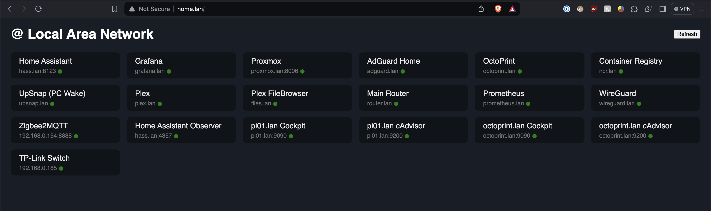

# Nathan's SmartHome / HomeLab

My home is becoming smarter day by day with the help of technology. I'm using this as a way to learn new things in software & hardware, and to make life easier!

https://trello.com/b/16M8tM5F/smart-home-homelab

## Overview

Dell Optiplex 7050 running Proxmox, 2 Raspberry Pi 3B+'s, 1 Raspberry Pi 4B.

## Base Software

Each of the phyiscal machines listed above as well as some Proxmox VMs have the following base software installed. See [ansible/playbooks/base.yml](./ansible/playbooks/base.yml).

* [Cockpit](https://cockpit-project.org/) - Linux server management web UI
* [Node Exporter](https://github.com/prometheus/node_exporter) - Machine metrics Prometheus exporter (CPU/mem/disk/network/etc.)
* [cAdvisor](https://github.com/google/cadvisor) - monitoring metrics for containers w/ Prometheus exporter endpoint (Only on servers which host containers)

## Services

The services I'm currently locally running include:

- [Home Assistant](https://www.home-assistant.io/) - Smart home magic! Dashboards, Automations, Mosquitto MQTT broker, and Control of devices via Zigbee/Matter/Bluetooth/etc.
- [Zigbee2MQTT](https://www.zigbee2mqtt.io/) - Bridge between Zigbee network (Sonoff Zigbee coordinator) and Home Assisant over MQTT topics
- [Plex Media Server](https://www.plex.tv/personal-media-server/) - Personal media server like Netflix or Hulu for my home... _"Nateflix"_
- [OctoPrint](https://octoprint.org/) - 3D Printer controller 
- [AdGuardHome](https://adguard.com/en/adguard-home/overview.html) - DNS server which hosts CNAME records for my local services and blocks ads network-wide. Just like pihole.
- [WireGuardEasy](https://github.com/wg-easy/wg-easy) - WireGuard VPN + management UI
- [Prometheus](https://prometheus.io/) - Collects and stores metrics on machines and containers across my network
- [Grafana](https://grafana.com/) - Dashboards for Prometheus data
- [Speedtest Exporter](https://github.com/MiguelNdeCarvalho/speedtest-exporter) - Continuous Internet Monitoring (Speedtest + Uptime)
- [NGINX](https://www.nginx.com/) - web server acting as a reverse proxy for all my services
- [UpSnap](https://github.com/seriousm4x/UpSnap) - snappy UI for sending WakeOnLan packets to machines on local network
- [Distribution Docker Registry](https://hub.docker.com/_/registry) and [Docker Registry UI](https://github.com/Joxit/docker-registry-ui)

## LAN Home Page

I have a small python site at home.lan with shortcuts + live status indicator for each service/site in my LAN. Source code at [./lanindex](./lanindex). It is deployed as a docker container on pi01 and behind nginx proxy.

## Hardware

- Dell Optiplex 7050 Micro (proxmox.lan)
  - Running Proxmox Hypervisor
  - VMs:
    - Home Assistant
    - Ubuntu Desktop
    - _WIP_: VM with Plex Media Server and related media docker containers

- Raspberry Pi 4 (pi01.lan)
  - Running most of my services currently. In the process of moving many of the containers over to a VM (or LXCs) on the Proxmox box.

- Raspberry Pi 3 (pi02.lan)
  - This previously hosted Home Assistant, but I've since moved it into a VM on Proxmox (has been way more stable)
  - Planning to repurpose this Pi as a backup for certain services like AdGuard Home.

- Raspberry Pi 3 (octoprint.lan)
  - Octoprint 3D printer control software
  - Also runs zigbee2mqtt container for my Zigbee network due to the location of the Pi being ideal for the Zigbee coordinator.

## Ansible

All the software here (besides Home Assistant) is deployed and configured with Ansible. No manual installation commands.

The vast majority of the Ansible roles simply deploy docker containers with docker-compose. I try to avoid installing things directly on the hosts when possible. This keeps things easier to maintain.
